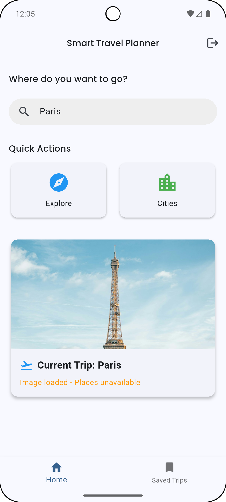
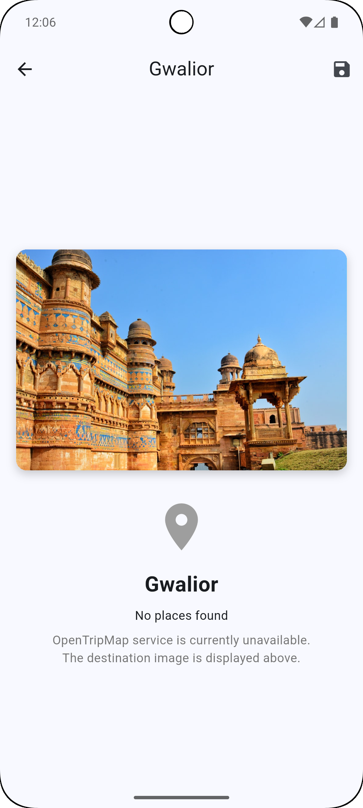
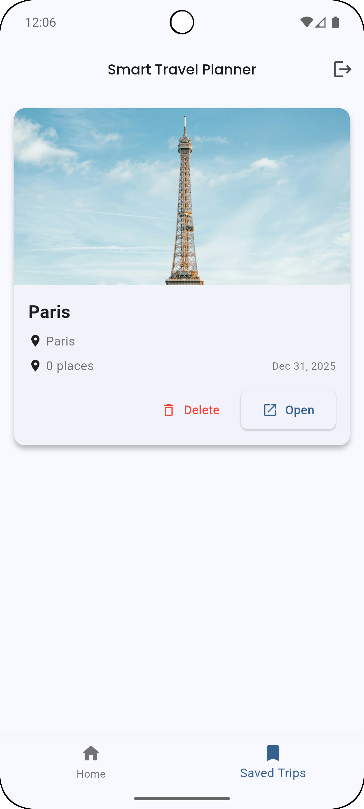

# Smart Travel Planner

<div align="center">


A modern Flutter-based travel planning application that helps users discover and visualize destinations with beautiful imagery.

**Developed by:** [Satvik (furyydev)](https://github.com/furyydev)

</div>

---

## 📱 Overview

Smart Travel Planner is a mobile application built with Flutter that enables users to search for destinations by city name and view high-quality destination images. The app provides a clean, intuitive interface for planning and organizing travel experiences, even when external API services face limitations.

### Key Highlights

- 🎨 **Beautiful UI**: Modern Material Design 3 interface
- 🖼️ **High-Quality Images**: Powered by Unsplash API
- 💾 **Local Storage**: Save and manage your travel plans offline
- 🔍 **Smart Search**: Quick city search functionality
- 📱 **Cross-Platform**: Built with Flutter for Android and iOS

---

## 🎯 Features

| Feature | Description |
|---------|-------------|
| **City Search** | Search for any city worldwide by name |
| **Destination Images** | View stunning high-quality images using Unsplash API |
| **Trip Management** | Save, view, and delete your travel plans |
| **User Authentication** | Simple and secure login system |
| **Responsive Design** | Optimized for various screen sizes |
| **Image Caching** | Fast loading with intelligent image caching |

---

## 🛠️ Technology Stack

- **Framework**: Flutter 3.10.4+
- **Language**: Dart
- **State Management**: Provider
- **HTTP Client**: `http` package
- **Local Storage**: `shared_preferences`
- **Image Caching**: `cached_network_image`
- **Environment Variables**: `flutter_dotenv`
- **Date Formatting**: `intl`
- **UI Components**: Material Design 3

---

## 📡 API Integration Status

### ✅ Unsplash API (Active)

The app currently uses **Unsplash API** as the primary data source for destination imagery.

**Functionality:**
- Fetches high-quality destination images based on city name
- Provides reliable API responses
- Images are cached for optimal performance
- Graceful error handling

**How it works:**
1. User enters a city name in the search field
2. App queries Unsplash API with the city name
3. High-quality destination images are fetched and displayed
4. Images are cached locally for faster subsequent loads

### ❌ OpenTripMap API (Not Working)

**Status:** Unavailable due to external service issues

**Original Intended Functionality:**
- Fetch destination coordinates (latitude/longitude)
- Retrieve tourist attractions and places of interest
- Get detailed information about destinations

**Impact:** 
- Cannot fetch required latitude and longitude coordinates
- Place/attraction data is unavailable
- Weather data cannot be retrieved (depends on coordinates)

### ⚠️ OpenWeatherMap API (Dependent)

**Status:** Present in codebase but non-functional

**Reason:**
- Requires latitude and longitude coordinates to fetch weather data
- Coordinates were intended to come from OpenTripMap API
- Since OpenTripMap is unavailable, weather functionality is disabled

### 📋 Implementation Decision

After encountering OpenTripMap API issues, the development team concluded to focus on the **Unsplash API integration**, which successfully provides:

- ✅ Beautiful destination images
- ✅ Reliable API responses  
- ✅ Excellent user experience with visual content
- ✅ Graceful degradation when other services are unavailable

The app handles the absence of OpenTripMap data elegantly and still delivers a functional, visually appealing experience.

---

## 🚀 Getting Started

### Prerequisites

- Flutter SDK 3.10.4 or higher
- Dart SDK (included with Flutter)
- Android Studio / VS Code with Flutter extensions
- Git
- Unsplash API Key (see [API Keys Setup](#-api-keys-setup))

### Installation Steps

1. **Clone the repository**
   ```bash
   git clone <repository-url>
   cd grafit
   ```

2. **Install dependencies**
   ```bash
   flutter pub get
   ```

3. **Configure environment variables**
   
   Create a `.env` file in the `grafit/` directory:
   ```env
   OPENTRIPMAP_API_KEY=your_opentripmap_key_here
   WEATHER_API_KEY=your_weather_key_here
   UNSPLASH_ACCESS_KEY=your_unsplash_access_key_here
   ```
   
   > **Note:** Currently, only `UNSPLASH_ACCESS_KEY` is required for the app to function properly.

4. **Run the application**
   ```bash
   flutter run
   ```

### Building for Production

**Android APK:**
```bash
flutter build apk
```
Output: `build/app/outputs/flutter-apk/app-release.apk`

**Android App Bundle:**
```bash
flutter build appbundle
```

**iOS:**
```bash
flutter build ios
```

---

## 📁 Project Structure

```
lib/
├── main.dart                 # Application entry point
├── models/                   # Data models
│   ├── destination.dart      # Destination data model
│   ├── itinerary.dart        # Itinerary data model
│   ├── place.dart            # Place/attraction model
│   ├── trip.dart             # Trip data model
│   └── weather.dart          # Weather data model
├── providers/                # State management (Provider)
│   ├── auth_provider.dart    # Authentication state
│   ├── place_provider.dart   # Places state management
│   └── trip_provider.dart    # Trip state management
├── screens/                  # UI screens
│   ├── home_screen.dart      # Main home screen
│   ├── itinerary_screen.dart # Itinerary planning
│   ├── login_screen.dart     # User login
│   ├── place_detail_screen.dart    # Place details view
│   ├── place_list_screen.dart      # Places listing
│   └── saved_trips_screen.dart     # Saved trips view
├── services/                 # API and business logic
│   ├── api_service.dart      # Generic HTTP service
│   ├── open_trip_map_service.dart  # OpenTripMap integration
│   ├── storage_service.dart  # Local storage service
│   ├── unsplash_service.dart # Unsplash API integration
│   └── weather_service.dart  # Weather API integration
├── utils/                    # Utilities and constants
│   ├── constants.dart        # App constants and API keys
│   └── theme.dart            # App theme configuration
└── widgets/                  # Reusable UI components
    ├── itinerary_item.dart   # Itinerary item widget
    ├── place_card.dart       # Place card widget
    ├── search_bar.dart       # Search bar widget
    └── weather_card.dart     # Weather card widget
```

---

## 🔑 API Keys Setup

### Unsplash API Key (Required)

1. Visit [Unsplash Developers](https://unsplash.com/developers)
2. Create an account or log in to your existing account
3. Navigate to "Your Applications" and create a new application
4. Copy your **Access Key**
5. Add it to your `.env` file:
   ```env
   UNSPLASH_ACCESS_KEY=your_access_key_here
   ```

### Optional API Keys

These keys are optional as the corresponding services are currently non-functional:

- **OpenTripMap API Key**: For future use when the service becomes available
- **OpenWeatherMap API Key**: Requires coordinates (not functional without OpenTripMap)

---

## 📸 Screenshots

### Login Screen

The app starts with a clean login interface featuring the Smart Travel Planner branding.


**Features:**
- Simple username and password authentication
- Demo mode (any credentials work for testing)
- Clean Material Design interface

---

### Home Screen

The main screen provides quick access to search functionality and displays the current trip.



**Features:**
- Search bar for city names
- Quick action buttons (Explore, Cities)
- Current trip display with destination image
- Status indicators for API availability

---

### Destination Detail Screen

View detailed information about a selected destination with beautiful imagery.

#### Paris - Eiffel Tower


**Features:**
- High-quality destination images from Unsplash
- Location information display
- Status messages for API availability
- Clean, focused UI for destination viewing

#### Gwalior - Fort



**Features:**
- Displays destination images for any city worldwide
- Graceful handling of unavailable services
- Clear user feedback about service status

---

### Saved Trips Screen

Manage all your saved travel plans in one place.



**Features:**
- List of all saved destinations
- Trip cards with destination images
- Quick actions: Delete or Open trip
- Date information for each trip
- Navigation between Home and Saved Trips

---

## 🎨 Features in Detail

### Search Functionality
- **Intuitive Search**: Enter any city name in the search bar
- **Real-time Results**: Instant image fetching from Unsplash
- **Beautiful Display**: Images shown in elegant card layouts
- **Error Handling**: Graceful degradation when services are unavailable

### Trip Management
- **Save Destinations**: Store your favorite travel destinations
- **View Saved Trips**: Access all saved trips in a dedicated screen
- **Delete Trips**: Remove trips you no longer need
- **Trip Details**: View comprehensive information about each trip

### User Interface
- **Material Design 3**: Modern UI components following Google's latest design guidelines
- **Smooth Animations**: Fluid transitions and animations throughout the app
- **Responsive Layout**: Optimized for various screen sizes and orientations
- **Image Caching**: Intelligent caching for faster image loading
- **Dark Mode Ready**: Theme system supports future dark mode implementation

---

## 🐛 Known Issues

| Issue | Status | Description |
|-------|--------|-------------|
| OpenTripMap API | External | Service is not functioning (external issue) |
| Weather Data | Dependent | Cannot display weather (requires coordinates from OpenTripMap) |
| Place Data | Dependent | Limited place/attraction data (depends on OpenTripMap) |

---

## 🔮 Future Enhancements

- [ ] Integrate alternative geocoding API to replace OpenTripMap
- [ ] Add weather functionality once coordinates are available
- [ ] Implement place recommendations and suggestions
- [ ] Enhanced itinerary planning features
- [ ] Map integration for visual trip planning
- [ ] Social sharing capabilities
- [ ] Offline mode with cached data
- [ ] Dark mode support
- [ ] Multi-language support
- [ ] Trip collaboration features

---

## 🤝 Contributing

This is an educational project. Contributions, suggestions, and feedback are welcome!

---

## 📝 License

This project is created for educational purposes.

---

## 👤 Author

**Satvik (furyydev)**

- GitHub: [@furyydev](https://github.com/furyydev)

---

## 📌 Important Notes

> **API Status**: This project was developed with a focus on providing a functional travel planning experience despite API limitations. The Unsplash integration ensures users can still enjoy beautiful destination imagery while planning their travels.

> **OpenTripMap Issue**: During development, the OpenTripMap API was experiencing issues on their side and was not functioning properly. This affected the ability to fetch coordinates, which in turn prevented weather data from being displayed. The app gracefully handles these limitations and continues to provide value through the Unsplash image integration.

---

<div align="center">

**Made with ❤️ using Flutter**

</div>
